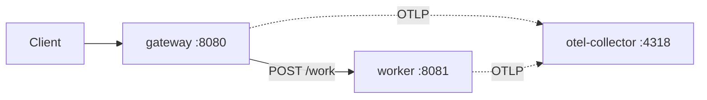

# Architecture

## Overview

This repository currently runs a minimal three-container local stack:

- `gateway`: public HTTP entrypoint on `:8080`
- `worker`: downstream service on `:8081`
- `otel-collector`: OTLP receiver for future telemetry export

## Topology

## Request Flow

1. Client sends `POST /work` to `gateway`.
2. `gateway` calls `worker` over the Docker Compose network.
3. `worker` returns `{"result":"done"}`.
4. `gateway` returns the worker response to the client.

## Current Design Notes

- The collector is included now so application telemetry can be added without changing the local topology later.
- `gateway` and `worker` already receive OTLP-related environment variables from Compose.
- The current app code does not emit telemetry yet. That is a follow-up step.
